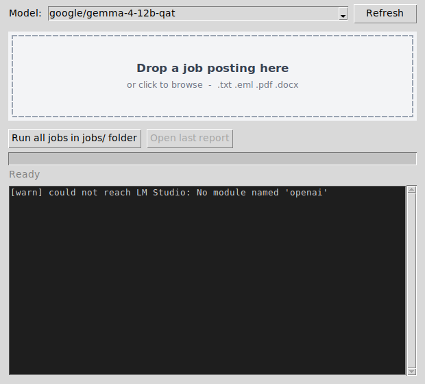

# resume_matcher

Scaffolding for a local, private resume-to-job matcher. It scores every resume in a
folder against each job posting using a local Gemma 4 model served by
[Unsloth Desktop](https://unsloth.ai/), then reports the top 5 matches per
job. Everything runs on your own machine; nothing leaves it.

## Workflow

1. **Job postings arrive by email.** Save each posting into the `jobs/`
   folder as a `.txt` or `.eml` file, or drop it straight on the window.
2. **Resumes live in a folder** (`resumes/` by default) as `.pdf`, `.docx`, or `.doc`.
3. For every job posting, each resume is sent to Gemma with the posting and the
   model returns a 0–100 match score plus a one-sentence comment.
4. Scores are collected and the **top 5 resumes per job** are reported.

## Setup

You need two things installed: **Python 3.10 or newer** (from
[python.org](https://www.python.org/downloads/); on Windows tick *Add Python to
PATH*) and **Unsloth Desktop** with a model loaded. That's it - no `pip`, no
virtual environments. The first time you start it, it creates a private
environment inside the `app/` folder and installs everything into it, showing a
progress bar (a minute or two); after that it opens straight away.

In Unsloth Desktop:

1. Download one of the supported Gemma 4 QAT models (pick by the memory you
   have - VRAM, or RAM if running on CPU):

   | Model | Needs roughly | When to pick it |
   | --- | --- | --- |
   | `gemma-4-e4b-it-qat` | ~6 GB | Small GPUs (6-8 GB) or CPU-only. Fastest; least discerning. |
   | `gemma-4-12b-it-qat` | ~12 GB | The default. Ranks the bundled examples correctly. |
   | `gemma-4-26b-a4b-it-qat` | ~24 GB | Best quality. Mixture-of-experts with ~4B active, so it still decodes quickly once loaded. |

   The sizes are approximate and include room for the context length the tool
   needs (see *Throughput* below). If a model fails to load or falls back to
   CPU, step down one row.
2. Load the model and start Unsloth Desktop's local server.
3. Check the server address it shows. The tool assumes
   `http://localhost:8888/v1`; if yours differs, enter it on the window's
   *Server* tab, or set `RM_LLM_BASE_URL` / pass `--base-url` - **including
   the `/v1` suffix**.

The tool preselects whichever loaded model's id contains the configured name
(`gemma-4-12b` by default, `RM_LLM_MODEL` to change), so the exact id the
server reports does not need to be typed in.

**Turn on Settings > API > "Switch model by request" in Unsloth Desktop.**
With it on, the server loads whichever installed model a request names, so
the tool can pick and switch models by itself; before a run (and when you
pick a model on the Server tab) it sends a one-token request and waits for the
model to come up - large models take a minute to come off disk. Without the
setting, the model must be loaded in the app by hand first, and the tool says
so (the app's own load endpoint is internal and cannot be called by clients).

Note: `.doc` (legacy Word) files additionally need `antiword` or LibreOffice
installed; `.pdf` and `.docx` work out of the box.

## Usage

Put your resumes in `resumes/`, then double-click **`ResumeMatcher.bat`**
(Windows) or run `python app/run_gui.py` (macOS / Linux). A window opens:



The window uses the Windows 11 look and follows your *Settings >
Personalization > Colors* app mode, so it comes up light or dark to match the
rest of the desktop, and it renders sharp on scaled (high-DPI) displays.

- **Drop a job posting** (`.txt`, `.eml`, `.pdf`, `.docx`) on the drop zone to
  score that one job against every resume in `resumes/`. Clicking the zone
  opens a file browser instead.
- **"Run all jobs in jobs/ folder"** does the regular matching over every
  posting in `jobs/`.
- Pick the model from the dropdown (populated from the server), watch progress
  and log output live, and the HTML report opens automatically when finished.

The first run also creates a **Resume Matcher** shortcut, next to the `.bat`
and in the Start Menu. It does the same thing but shows the app icon and
starts without the brief console flash - use that from then on. Because it
is in the Start Menu you can search for it, and right-clicking the running
app's taskbar button offers *Pin to taskbar*. If Python is not installed, the launcher says so and where
to get it; any other startup problem appears in a dialog box.

#### Server tab: local server or hosted API

The *Server* tab decides where the model runs. Pick a preset and the fields
fill in:

- **Local server** - Unsloth Desktop (default) or any other OpenAI-compatible
  server on this machine. Nothing leaves the computer. *Fetch models* lists
  what the server has loaded and preselects the configured one.
- **Hosted API** - OpenAI, OpenRouter, Groq, or a custom OpenAI-compatible
  endpoint. Paste your API key and type the model id (hosted catalogs are
  too large to pick from). A notice on the tab spells out the trade-off:
  **job postings and the full text of every resume are sent to that
  provider.** Use it knowingly - resumes are personal data.

*Test connection* checks the address and key. *Save* writes the tab to
`app/settings.json`; every run also saves it, so what you see is what runs.
The file is gitignored because it can contain an API key.

If the window cannot reach the model server, the *Server* tab gets a red dot
and the line at the top of the *Match* tab turns red; clicking it takes you to
the Server tab. Runs also check the connection first, so a stopped server
fails immediately with that highlight rather than after scoring every resume.

The preset model ids are starting points; providers rename models often, so
check their current lists. Everything speaks the same OpenAI-compatible API,
so any provider that does will work even without a preset - pick *Custom* and
fill in the address yourself.

Drag-and-drop needs the optional `tkinterdnd2` package and the Windows 11
look needs `sv-ttk`, both from `requirements.txt`; without them the drop zone
still works as click-to-browse and the window keeps the stock look. The window
itself needs tkinter, which ships with Python on Windows and macOS (on Linux:
`sudo apt install python3-tk`).

### Trying it with the sample data

`app/examples/` holds five job postings (one as a saved `.eml` email) and five
resumes in PDF/DOCX with deliberately varied fit - a strong match for each
job, a generalist, and a marketing resume that should score low across the
board - so you can eyeball whether the model's rankings make sense.

To try them: copy the files from `app/examples/resumes/` into `resumes/`, then
drop any file from `app/examples/jobs/` on the window.

### What a run produces

While running, the window shows progress across all job x resume pairs and
the log as it happens. Results are saved under `results/` (gitignored, one
timestamped set per run) in three formats: an HTML report, plain text, and
JSON. The HTML report opens automatically when the run finishes - each job is
an expandable section listing its top matches with color-coded score badges,
and every resume name links to the source file on disk.

### Scanned and image-based resumes

Scanned PDFs with no text layer, and plain image files (.png/.jpg/.webp), are
OCR-ed with [Tesseract](https://github.com/tesseract-ocr/tesseract)
automatically when it is installed (seconds per page, fully offline; see
requirements.txt for install pointers - on Windows the default install
location is auto-detected). If Tesseract is unavailable, set `RM_OCR=1` to
fall back to transcribing the image with the model's vision input instead -
no extra install, but minutes per page on partial GPU offload, and it
requires a vision-capable model. Either way the extracted text is scored in a
fresh call, like any other resume; with neither option available,
image-based resumes are skipped with a note.

### Settings

Settings layer in this order, later ones winning: built-in defaults, then
`app/settings.json` (written by the Server tab), then environment variables.
The useful ones are `RM_LLM_BASE_URL`, `RM_LLM_API_KEY`, `RM_LLM_MODEL`,
`RM_CONCURRENCY`, `RM_LLM_TIMEOUT`, and `RM_VERBOSE=1` to log the model's raw
reply for every scoring call. Input and output folders default to the
project's `resumes/`, `jobs/`, and `results/` regardless of where the app is
started from. See `app/resume_matcher/config.py`.

## Throughput (concurrent scoring)

Scoring calls are independent, so the tool keeps several in flight at once and
lets the server batch them. This is a large speed-up on GPU: in a local
benchmark against a mock server, a 30-call run went from 12.3s to 4.3s.

Each request still contains exactly one job and one resume, so concurrency
changes only how many are in flight - never what the model sees.

Set it in the *Server* tab's **Concurrent requests** box (default 4, `1` for
sequential), or with the `RM_CONCURRENCY` environment variable.

**Matching settings in Unsloth Desktop** (in the model/server settings;
reload the model after changing them). The exact labels may differ, but the
two that matter are:

- **Parallel requests / concurrent slots** - must be >= the concurrency you set (4),
  or the extra requests just queue on the server and you gain nothing.
- **Context length** - llama.cpp-based servers divide the context across
  concurrent slots, so the per-request budget is roughly
  `context length / parallel slots`. A job + resume + reply needs ~3-4k
  tokens, so for 4 slots set the context to **16384**. If replies start coming
  back empty or truncated after raising concurrency, this is the cause: raise
  the context or lower the concurrency.

Also put as many layers on the GPU as fit: batching wins come from the GPU
decoding several sequences at once, and a mostly-CPU model gains much less.
If the server offers flash attention or GPU KV-cache options, leave them on.

Note that resumes are scored concurrently *within* a job, while jobs are
processed one after another, so a run with many jobs and few resumes will not
saturate a high concurrency setting.

If the server has fewer parallel slots than that, the extra requests wait in
its queue; the tool retries a "busy" answer (HTTP 429/503) with backoff for
up to two minutes, but a request that times out is **never resent** - the
server would still finish the original and the work would double. The
per-request timeout is 10 minutes (`RM_LLM_TIMEOUT` to change), which allows
for that queueing; if you still see timeouts, lower the concurrency or raise
the server's slots. The OpenAI client's own automatic retries are switched off
for the same reason.

## Project layout

The root holds only what a user touches; everything technical is in `app/`.

| Path | What it is |
| --- | --- |
| `ResumeMatcher.bat` | The launcher - double-click to start (works even without Python: it says where to get it) |
| `Resume Matcher.lnk` | Shortcut the launcher creates on first run (also placed in the Start Menu): same thing with the app icon |
| `resumes/`, `jobs/` | Your resumes and saved job postings |
| `results/` | Reports from each run (created on first run) |
| `app/run_gui.py`, `run_gui.bat` | What the launcher runs (`python app/run_gui.py` on macOS / Linux) |
| `app/bootstrap.py` | First-run setup: create `.venv`, install requirements, relaunch |
| `app/make_shortcut.ps1` | First-run setup: the shortcuts, stamped with the app id so taskbar pinning works |
| `app/requirements.txt` | Dependencies, installed automatically on first run |
| `app/.venv/`, `settings.json`, `setup.log` | Created on first run (not in git) |
| `app/examples/` | Sample jobs and resumes to try it out |
| `app/tests/` | Test suite |
| `app/resume_matcher/email_ingest.py` | Load job postings from the `jobs/` folder, or a single dropped file |
| `app/resume_matcher/documents.py` | Extract text from PDF/DOCX/DOC resumes; OCR for scans |
| `app/resume_matcher/llm_client.py` | Talk to the model server's OpenAI-compatible API |
| `app/resume_matcher/providers.py` | Presets for the Server tab; model-id matching |
| `app/resume_matcher/scoring.py` | Match prompt + robust parsing of the model's score/comment |
| `app/resume_matcher/matcher.py` | Score jobs x resumes concurrently, keep top N |
| `app/resume_matcher/report.py` | Save HTML/text/JSON reports |
| `app/resume_matcher/gui.py` | Desktop window: Match tab and Server tab - the only entry point |
| `app/resume_matcher/icon.ico`, `icon.png` | The window's icon |
| `app/resume_matcher/config.py` | Settings, layered from defaults, `settings.json`, env |

## Tests

```bash
cd app
.venv/bin/python -m pip install pytest
.venv/bin/python -m pytest
```
