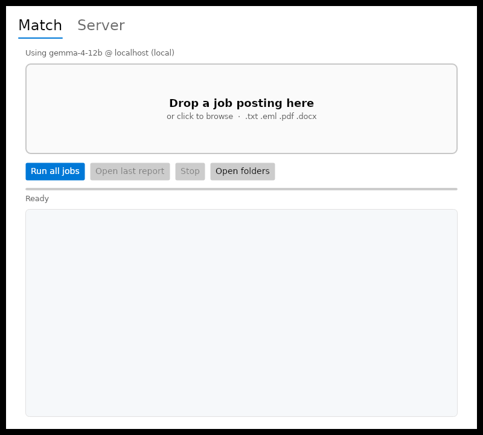
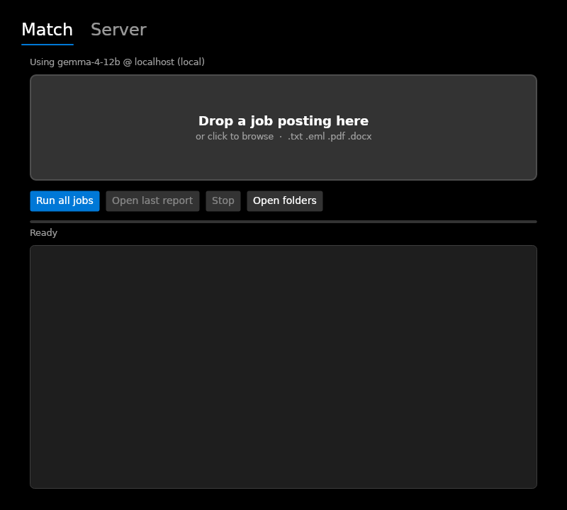
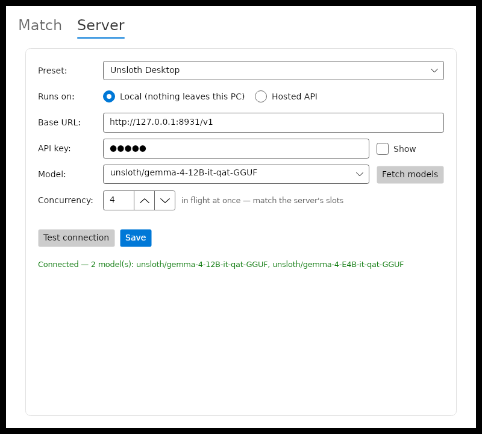
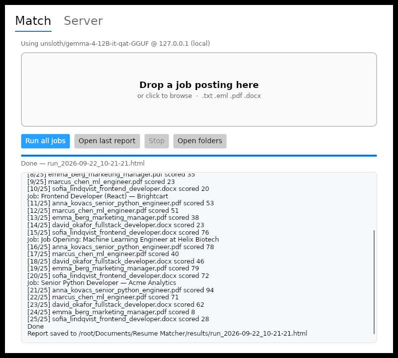

# Resume Matcher — native Windows build

An experiment on the `windows-native` branch: the same tool as the Python app on
`main`, rebuilt in C# so the machine running it needs **neither Python nor .NET
installed**. The whole thing ships as one `ResumeMatcher.exe`.



## What it does

Unchanged from the Python version. Every resume in a folder is scored against
each job posting by a local Gemma model served over an OpenAI-compatible API,
and the top 5 per job are reported. Each request still carries exactly one job
and one resume, so resumes never share a context.

## What this buys over the Python app

| | Python (`main`) | This branch |
| --- | --- | --- |
| Prerequisite | Python 3.10+, installed by the user | none |
| First run | creates a venv, pip-installs 6 packages | starts |
| Delivery | clone the repo, double-click a `.bat` | run an installer, or the bare `.exe` |
| PDF text | pymupdf | PdfPig (managed, no native DLL) |
| DOCX text | python-docx | the framework's zip + XML reader |
| Drag and drop | optional `tkinterdnd2` | built in |
| Theme | `sv-ttk`, read from the registry by hand | built into the toolkit |
| Taskbar pinning | a PowerShell script writing a shortcut | one line in the installer |

Whole categories of problem disappear with the interpreter: no Store-stub
`python.exe`, no `init.tcl` hunt, no venv, no console flash, no `.bat`.

## Getting it

Either run `ResumeMatcherSetup.exe`, or just run `ResumeMatcher.exe` on its own —
it is self-contained and needs no install. The installer only adds Start Menu
and desktop shortcuts, an uninstall entry, and the application id that makes
*Pin to taskbar* work.

Your files live in **Documents\Resume Matcher** (`resumes`, `jobs`, `results`),
because an app in `Program Files` cannot write next to itself. Settings go to
`%APPDATA%\ResumeMatcher\settings.json`. The *Open folders* button opens them.

## Layout

```
windows/
  src/ResumeMatcher.Core/    all the logic, plain net8.0 — no UI, no Windows types
  src/ResumeMatcher.App/     the window (Avalonia), ~400 lines of glue
  tests/ResumeMatcher.Tests/ 42 tests, run anywhere
  installer/                 Inno Setup script
```

Keeping `Core` free of UI and platform types is what makes the logic testable on
any machine, and would let a different front end (WinUI 3, WPF) reuse it
unchanged.

## Building

```bash
dotnet test tests/ResumeMatcher.Tests
dotnet publish src/ResumeMatcher.App -p:PublishProfile=win-x64
```

The publish produces `src/ResumeMatcher.App/bin/publish/win-x64/ResumeMatcher.exe`
(~47 MB — it carries the .NET runtime). Both commands work from Linux or macOS
as well as Windows; only the installer needs Windows, and
`.github/workflows/windows-build.yml` builds both on a Windows runner.

## About the UI toolkit

The window is [Avalonia](https://avaloniaui.net/) with its Fluent theme, not
WPF or WinUI 3. That was a deliberate, and partly forced, choice:

- Avalonia builds and **runs** on Linux, so every screenshot here was produced
  by running the real application, and the UI could be driven end to end
  against a mock model server before it ever reached Windows. WPF cross-builds
  in principle, but the Windows Desktop SDK targets were not obtainable in the
  build environment used here.
- Architecturally it is the same kind of toolkit as WPF: both draw their own
  Fluent-styled controls rather than wrapping Win32 common controls.

If you want strictly first-party Microsoft UI, WinUI 3 is the option, and
`Core` would carry over untouched — only `ResumeMatcher.App` would be rewritten.
That build has to happen on Windows.

## Known gaps against the Python version

- **No OCR.** Scanned PDFs and image resumes are skipped. The natural fix here
  is `Windows.Media.Ocr`, which is built into Windows 10+ and would remove the
  Tesseract install the Python version asks for — but it needs a Windows SDK
  target that could not be built in this environment.
- **No vision-model transcription** (`RM_OCR` on `main`).
- **Not code-signed.** A downloaded, unsigned `.exe` triggers SmartScreen; see
  the discussion on `main`. Running from a local build does not.
- The `Azure AI Foundry` preset points at the OpenAI-compatible `/openai/v1`
  endpoint. The classic `?api-version=` endpoint uses a different auth header
  and is not supported.

## Screenshots

| Match tab (dark) | Server tab |
| --- | --- |
|  |  |

A finished run against a mock model server:


